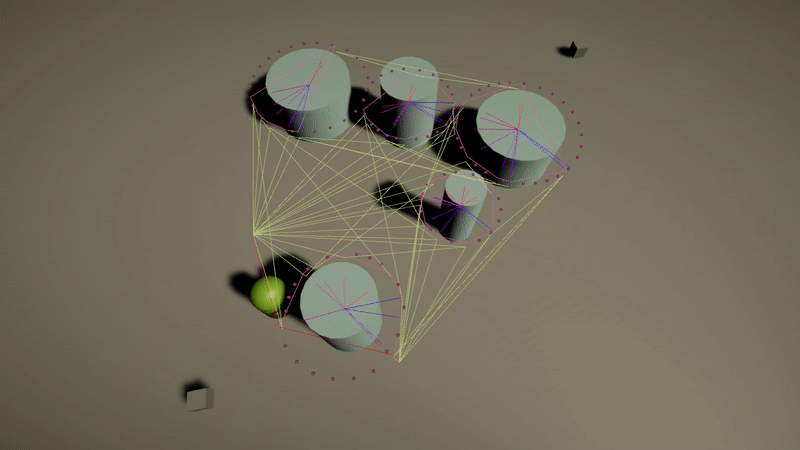
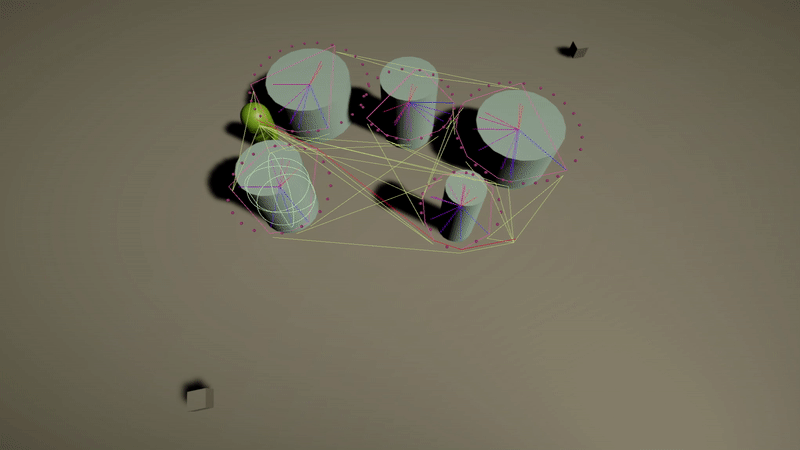
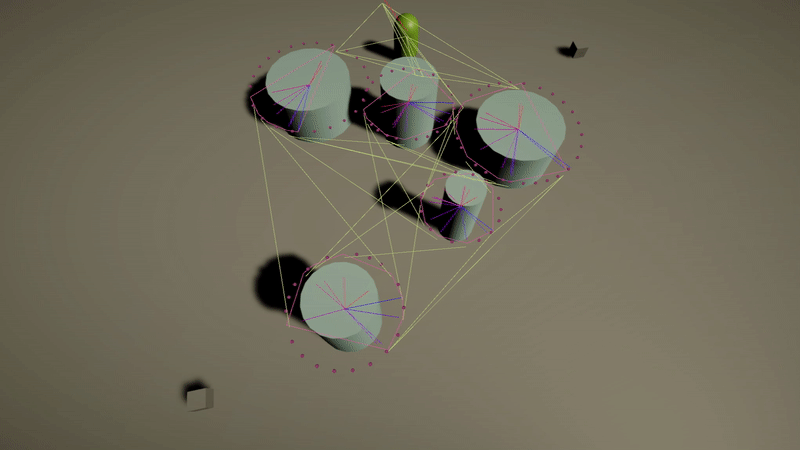
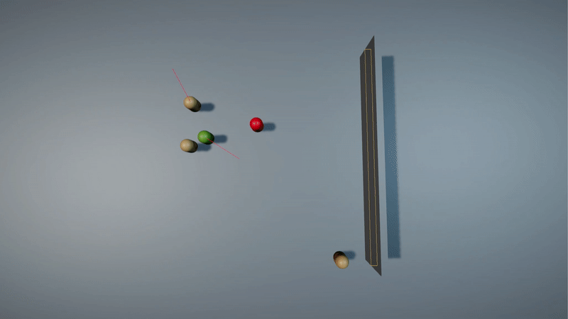
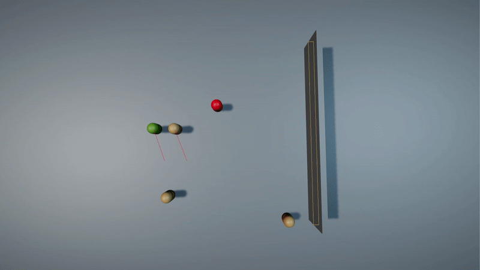

## Circular Obstacle Pathfinding and A-Star

[Implementation](Assets/Scripts/Pathfinding/CircularObstacleGraph/CircularObsticleGraphGenerator.cs) of COP [algorithm](https://redblobgames.github.io/circular-obstacle-pathfinding/). It creates a [graph](Assets/Scripts/Pathfinding/Graph/Graph.cs) based on a forest of rounded obstacles. \
A-Star is also [implemented](Assets/Scripts/Pathfinding/Algorithms/AStar.cs) to find the shortest path on that graph.

### Demo gifs:

**Pathfinding with changing goal**\

**Another example**\

**Graph recalculation when obstacles move**\

## Optimal Reciprocal Collision Avoidance

Also [ORCA](http://gamma.cs.unc.edu/ORCA/) have been integrated into a project with [RVO-2 library](https://github.com/snape/RVO2-CS). 

### Examples:

